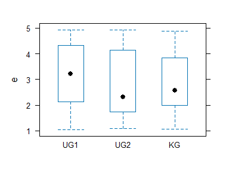
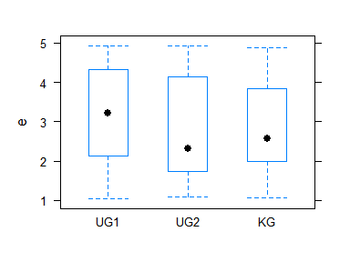

<!-- README.md is generated from README.Rmd. Please edit that file -->

# stp25output2

Die Scripten dienen der Erstellung von Reports als HTML aber auch von
PDF ueber knit. Zum Teil handelt es sich um modifizerte Funktionen von
R2HTML, texreg und htmlTable.

## Overview

-   Initialisiert von neuen Projekten
    -   `Projekt()` und `End()` Initialisiert ein neues Projekt und
        aufruf der HTML-Seite mit Hilfe von R2HTML.
-   Text und Tabellen-Formatierung
    -   `Output` Erstellt Tabellen
    -   `Text`, `Head` und `Head1 ...` Schreibt HTML Text.
-   Hilfsfunktionen
    -   `SavePlot` Speichert Bilder in den Arbeitsfolder.

## Output formats

| File | Type            | Parameter       | which_output() |
|------|-----------------|-----------------|----------------|
| r    |                 |                 | text           |
| r    | Projekt(“html”) |                 | html           |
| r    | spin            | html_document   | markdown_html  |
| r    | spin            | pdf_document    | latex          |
| r    | spin            | word_document   | docx           |
| Rmd  |                 | html_document   | markdown_html  |
| Rmd  |                 | pdf_document    | latex          |
| Rmd  |                 | word_document   | docx           |
| Rmd  |                 | beamer          | latex          |
| Rmd  |                 | github_document | markdown_html  |

## Projekt

Initialisieren eines Projektes.

``` r
# devtools::install_github("stp4/stp25output")
 
Projekt("md", "Beispiel Projekt",
        datum = date(),
        silent =FALSE
        )
#> 
#>  Projekt_Rmd 
#> 
#> format:  md  output:   markdown 
#>  c:/users/wpete/dropbox/3_forschung/r-project/stp25output2/readme.rmd
#> script:  README.Rmd

#stp25settings
set_opt(prozent=list(digits=c(1,0), style=2))

warpbreaks2 <- Label(warpbreaks,
                     breaks =   "The number of breaks",
                     wool   =   "The type of wool",
                     tension    =   "The level of tension")
 

warpbreaks2 %>%
  Tbll_desc(breaks + tension ~ wool)
#> # A tibble: 6 x 3
#>   Item                          A               B             
#>   <chr>                         <chr>           <chr>         
#> 1 "(N) "                        "27"            "27"          
#> 2 "The number of breaks (mean)" "31.04 (15.85)" "25.26 (9.30)"
#> 3 "The level of tension "       ""              ""            
#> 4 "    L"                       "9 (33%)"       "9 (33%)"     
#> 5 "    M"                       "9 (33%)"       "9 (33%)"     
#> 6 "    H"                       "9 (33%)"       "9 (33%)"

End()
```

### Usage

data.frame()

``` r
which_output()
```

\[1\] “text”

``` r
 
dat<- data.frame(
term = c("A", "B", "C", "D"),
n = c(23, 14, 56, 2),
m = c("4.7 (2.4)", "4.1 (2.3)", "8.9 (3.6)", NA)
) 

dat  %>% Output("data.frame()")
```

Tab 1: data.frame() term n m 1 A 23 4.7 (2.4) 2 B 14 4.1 (2.3) 3 C 56
8.9 (3.6) 4 D 2 <NA>

``` r
# matrix(c("a1","a2",3,4,5,6),
#                 nrow=2, byrow=TRUE,
#                 dimnames=list(gender=c("M", "F"),
#                               party=c( "Dem", "Ind", "Rep")))  #%>% Output("matrix()")

as.table(matrix(c("a1","a2",3,4,5,6),
                 nrow=2, byrow=TRUE,
                 dimnames=list(gender=c("M", "F"),
                               party=c( "Dem", "Ind", "Rep")))) %>% Output("as.table()")
```

Tab 2: as.table() gender party_Dem party_Ind party_Rep 1 M a1 a2 3 2 F 4
5 6

``` r
 
warpbreaks2 %>%
  Tbll_desc(breaks + tension + wool) %>% Output("")
```

Tab 3:  
Item m 1 (N) 54 2 The number of breaks (mean) 28.15 (13.20) 3 The level
of tension  
4 L 18 (33%) 5 M 18 (33%) 6 H 18 (33%) 7 The type of wool  
8 A 27 (50.0%) 9 B 27 (50.0%)

### Verschiedene Szenarien

``` r
 
df1 %>% Output()
#> 
#>  Tab 4:  
#>   term  n         m
#> 1    A 23 4.7 (2.4)
#> 2    B 14 4.1 (2.3)
#> 3    C 56 8.9 (3.6)
#> 4    D  2      <NA>
#> 
#> 
```

``` r
df1 %>% Output()
```

Tab 5:  
term n m 1 A 23 4.7 (2.4) 2 B 14 4.1 (2.3) 3 C 56 8.9 (3.6) 4 D 2 <NA>

``` r
df1 %>% Output(output="text")
#> 
#>  Tab 6:  
#>   term  n         m
#> 1    A 23 4.7 (2.4)
#> 2    B 14 4.1 (2.3)
#> 3    C 56 8.9 (3.6)
#> 4    D  2      <NA>
#> 
#> 
```

``` r
df1 %>% Output(output="markdown")
```

| term |   n | m         |
|:-----|----:|:----------|
| A    |  23 | 4.7 (2.4) |
| B    |  14 | 4.1 (2.3) |
| C    |  56 | 8.9 (3.6) |
| D    |   2 |           |

## xtable()

Ist eine Package zum Erstellen von HTML und latex. Convert an R object
to an xtable object, which can then be printed as a LaTeX or HTML table

``` r
 
require(xtable)
#> Loading required package: xtable
data(tli)
## Demonstrate aov
fm1 <- aov(tlimth ~ sex + ethnicty + grade + disadvg, data = tli)
fm1.table <- xtable(fm1)

Output(fm1.table)
```

Tab 7:  
Df Sum.Sq Mean.Sq F.value Pr..F. sex 1 75.37255 75.37255 0.3751912
0.541683003 ethnicty 3 2572.14918 857.38306 4.2679008 0.007183052 grade
1 36.30740 36.30740 0.1807318 0.671727134 disadvg 1 59.30338 59.30338
0.2952017 0.588206240 Residuals 93 18682.86749 200.89105 NA NA

``` r
fm2 <- lm(tlimth ~ sex*ethnicty, data = tli)
fm2b <- lm(tlimth ~ ethnicty, data = tli)

#Output(xtable(anova(fm2b, fm2)), output="md")
```

## knitr::kable

``` r
knitr::kable(
  df1, row.names = FALSE,
  format = "pandoc" 
)
```

| term |   n | m         |
|:-----|----:|:----------|
| A    |  23 | 4.7 (2.4) |
| B    |  14 | 4.1 (2.3) |
| C    |  56 | 8.9 (3.6) |
| D    |   2 | NA        |

``` r
knitr::kable(
  df1, row.names = FALSE,
  format = "markdown" 
)
```

| term |   n | m         |
|:-----|----:|:----------|
| A    |  23 | 4.7 (2.4) |
| B    |  14 | 4.1 (2.3) |
| C    |  56 | 8.9 (3.6) |
| D    |   2 | NA        |

``` r
knitr::kable(
  df1, row.names = FALSE,
  format = "pandoc" 
)
```

| term |   n | m         |
|:-----|----:|:----------|
| A    |  23 | 4.7 (2.4) |
| B    |  14 | 4.1 (2.3) |
| C    |  56 | 8.9 (3.6) |
| D    |   2 | NA        |

## Grafik settings

``` r
 
set.seed(2)
n <- 20 * 3 * 2
DF <- data.frame(
  n = runif(n, min = 1, max = 5),
  e = runif(n, min = 1, max = 5),
  o = runif(n, min = 1, max = 5),
  g = runif(n, min = 1, max = 5),
  a = runif(n, min = 1, max = 5),
  treatment = gl(3, n / 3, labels = c("UG1", "UG2", "KG"))[sample.int(n)],
  sex = gl(2, n / 2, labels = c("male", "female"))
)
```

``` r
#set_lattice()
bwplot(e ~ treatment, DF)
```

<!-- -->

``` r
#set_lattice_ggplot()
bwplot(e ~ treatment, DF)
```

<!-- -->

``` r
#set_lattice_bw()
bwplot(e ~ treatment, DF)
```

<!-- -->

## A few methods for making tables in rmarkdown

Quelle: <https://gist.github.com/benmarwick/8ad99f35d5e4caa06492>

<https://github.com/yihui/printr>
<https://github.com/jalapic/simpletable>
<https://github.com/renkun-ken/formattable>

``` r
my_data <- head(iris)
names(my_data) <- c(letters[1:ncol(iris)])
```

``` r
library("knitr")
kable(my_data)
```

<table>
<thead>
<tr>
<th style="text-align:right;">
a
</th>
<th style="text-align:right;">
b
</th>
<th style="text-align:right;">
c
</th>
<th style="text-align:right;">
d
</th>
<th style="text-align:left;">
e
</th>
</tr>
</thead>
<tbody>
<tr>
<td style="text-align:right;">
5.1
</td>
<td style="text-align:right;">
3.5
</td>
<td style="text-align:right;">
1.4
</td>
<td style="text-align:right;">
0.2
</td>
<td style="text-align:left;">
setosa
</td>
</tr>
<tr>
<td style="text-align:right;">
4.9
</td>
<td style="text-align:right;">
3.0
</td>
<td style="text-align:right;">
1.4
</td>
<td style="text-align:right;">
0.2
</td>
<td style="text-align:left;">
setosa
</td>
</tr>
<tr>
<td style="text-align:right;">
4.7
</td>
<td style="text-align:right;">
3.2
</td>
<td style="text-align:right;">
1.3
</td>
<td style="text-align:right;">
0.2
</td>
<td style="text-align:left;">
setosa
</td>
</tr>
<tr>
<td style="text-align:right;">
4.6
</td>
<td style="text-align:right;">
3.1
</td>
<td style="text-align:right;">
1.5
</td>
<td style="text-align:right;">
0.2
</td>
<td style="text-align:left;">
setosa
</td>
</tr>
<tr>
<td style="text-align:right;">
5.0
</td>
<td style="text-align:right;">
3.6
</td>
<td style="text-align:right;">
1.4
</td>
<td style="text-align:right;">
0.2
</td>
<td style="text-align:left;">
setosa
</td>
</tr>
<tr>
<td style="text-align:right;">
5.4
</td>
<td style="text-align:right;">
3.9
</td>
<td style="text-align:right;">
1.7
</td>
<td style="text-align:right;">
0.4
</td>
<td style="text-align:left;">
setosa
</td>
</tr>
</tbody>
</table>

``` r
library("xtable")
print(xtable(my_data), type = "html", include.rownames=FALSE, html.table.attributes=list("border='0' cellpadding='5' "))
```

<!-- html table generated in R 4.1.2 by xtable 1.8-4 package -->
<!-- Sun Dec 12 10:20:37 2021 -->
<table border="0" cellpadding="5">
<tr>
<th>
a
</th>
<th>
b
</th>
<th>
c
</th>
<th>
d
</th>
<th>
e
</th>
</tr>
<tr>
<td align="right">
5.10
</td>
<td align="right">
3.50
</td>
<td align="right">
1.40
</td>
<td align="right">
0.20
</td>
<td>
setosa
</td>
</tr>
<tr>
<td align="right">
4.90
</td>
<td align="right">
3.00
</td>
<td align="right">
1.40
</td>
<td align="right">
0.20
</td>
<td>
setosa
</td>
</tr>
<tr>
<td align="right">
4.70
</td>
<td align="right">
3.20
</td>
<td align="right">
1.30
</td>
<td align="right">
0.20
</td>
<td>
setosa
</td>
</tr>
<tr>
<td align="right">
4.60
</td>
<td align="right">
3.10
</td>
<td align="right">
1.50
</td>
<td align="right">
0.20
</td>
<td>
setosa
</td>
</tr>
<tr>
<td align="right">
5.00
</td>
<td align="right">
3.60
</td>
<td align="right">
1.40
</td>
<td align="right">
0.20
</td>
<td>
setosa
</td>
</tr>
<tr>
<td align="right">
5.40
</td>
<td align="right">
3.90
</td>
<td align="right">
1.70
</td>
<td align="right">
0.40
</td>
<td>
setosa
</td>
</tr>
</table>

``` r
library(xtable)
print(xtable(my_data), type = 'html')
```

<!-- html table generated in R 4.1.2 by xtable 1.8-4 package -->
<!-- Sun Dec 12 10:20:37 2021 -->
<table border="1">
<tr>
<th>
</th>
<th>
a
</th>
<th>
b
</th>
<th>
c
</th>
<th>
d
</th>
<th>
e
</th>
</tr>
<tr>
<td align="right">
1
</td>
<td align="right">
5.10
</td>
<td align="right">
3.50
</td>
<td align="right">
1.40
</td>
<td align="right">
0.20
</td>
<td>
setosa
</td>
</tr>
<tr>
<td align="right">
2
</td>
<td align="right">
4.90
</td>
<td align="right">
3.00
</td>
<td align="right">
1.40
</td>
<td align="right">
0.20
</td>
<td>
setosa
</td>
</tr>
<tr>
<td align="right">
3
</td>
<td align="right">
4.70
</td>
<td align="right">
3.20
</td>
<td align="right">
1.30
</td>
<td align="right">
0.20
</td>
<td>
setosa
</td>
</tr>
<tr>
<td align="right">
4
</td>
<td align="right">
4.60
</td>
<td align="right">
3.10
</td>
<td align="right">
1.50
</td>
<td align="right">
0.20
</td>
<td>
setosa
</td>
</tr>
<tr>
<td align="right">
5
</td>
<td align="right">
5.00
</td>
<td align="right">
3.60
</td>
<td align="right">
1.40
</td>
<td align="right">
0.20
</td>
<td>
setosa
</td>
</tr>
<tr>
<td align="right">
6
</td>
<td align="right">
5.40
</td>
<td align="right">
3.90
</td>
<td align="right">
1.70
</td>
<td align="right">
0.40
</td>
<td>
setosa
</td>
</tr>
</table>

``` r
library(xtable)
print(xtable(my_data), type = 'html', html.table.attributes = '')
```

<!-- html table generated in R 4.1.2 by xtable 1.8-4 package -->
<!-- Sun Dec 12 10:20:37 2021 -->
<table>
<tr>
<th>
</th>
<th>
a
</th>
<th>
b
</th>
<th>
c
</th>
<th>
d
</th>
<th>
e
</th>
</tr>
<tr>
<td align="right">
1
</td>
<td align="right">
5.10
</td>
<td align="right">
3.50
</td>
<td align="right">
1.40
</td>
<td align="right">
0.20
</td>
<td>
setosa
</td>
</tr>
<tr>
<td align="right">
2
</td>
<td align="right">
4.90
</td>
<td align="right">
3.00
</td>
<td align="right">
1.40
</td>
<td align="right">
0.20
</td>
<td>
setosa
</td>
</tr>
<tr>
<td align="right">
3
</td>
<td align="right">
4.70
</td>
<td align="right">
3.20
</td>
<td align="right">
1.30
</td>
<td align="right">
0.20
</td>
<td>
setosa
</td>
</tr>
<tr>
<td align="right">
4
</td>
<td align="right">
4.60
</td>
<td align="right">
3.10
</td>
<td align="right">
1.50
</td>
<td align="right">
0.20
</td>
<td>
setosa
</td>
</tr>
<tr>
<td align="right">
5
</td>
<td align="right">
5.00
</td>
<td align="right">
3.60
</td>
<td align="right">
1.40
</td>
<td align="right">
0.20
</td>
<td>
setosa
</td>
</tr>
<tr>
<td align="right">
6
</td>
<td align="right">
5.40
</td>
<td align="right">
3.90
</td>
<td align="right">
1.70
</td>
<td align="right">
0.40
</td>
<td>
setosa
</td>
</tr>
</table>

``` r
library("pander")
pandoc.table(my_data)
```

|  a  |  b  |  c  |  d  |   e    |
|:---:|:---:|:---:|:---:|:------:|
| 5.1 | 3.5 | 1.4 | 0.2 | setosa |
| 4.9 |  3  | 1.4 | 0.2 | setosa |
| 4.7 | 3.2 | 1.3 | 0.2 | setosa |
| 4.6 | 3.1 | 1.5 | 0.2 | setosa |
|  5  | 3.6 | 1.4 | 0.2 | setosa |
| 5.4 | 3.9 | 1.7 | 0.4 | setosa |

``` r
library("pander")
pandoc.table(my_data, split.cells = 5)
```

|  a  |  b  |  c  |  d  |   e    |
|:---:|:---:|:---:|:---:|:------:|
| 5.1 | 3.5 | 1.4 | 0.2 | setosa |
| 4.9 |  3  | 1.4 | 0.2 | setosa |
| 4.7 | 3.2 | 1.3 | 0.2 | setosa |
| 4.6 | 3.1 | 1.5 | 0.2 | setosa |
|  5  | 3.6 | 1.4 | 0.2 | setosa |
| 5.4 | 3.9 | 1.7 | 0.4 | setosa |

``` r
pander::panderOptions('table.split.table', 350)
pander::pandoc.table(my_data, style="rmarkdown")
```

|  a  |  b  |  c  |  d  |   e    |
|:---:|:---:|:---:|:---:|:------:|
| 5.1 | 3.5 | 1.4 | 0.2 | setosa |
| 4.9 |  3  | 1.4 | 0.2 | setosa |
| 4.7 | 3.2 | 1.3 | 0.2 | setosa |
| 4.6 | 3.1 | 1.5 | 0.2 | setosa |
|  5  | 3.6 | 1.4 | 0.2 | setosa |
| 5.4 | 3.9 | 1.7 | 0.4 | setosa |

    library("ascii")
    print(ascii(my_data), type = 'pandoc')

``` r
library("htmlTable")
htmlTable(my_data, col.rgroup = c("none", "#F7F7F7"))
```

<table class="gmisc_table" style="border-collapse: collapse; margin-top: 1em; margin-bottom: 1em;">
<thead>
<tr>
<th style="border-bottom: 1px solid grey; border-top: 2px solid grey;">
</th>
<th style="font-weight: 900; border-bottom: 1px solid grey; border-top: 2px solid grey; text-align: center;">
a
</th>
<th style="font-weight: 900; border-bottom: 1px solid grey; border-top: 2px solid grey; text-align: center;">
b
</th>
<th style="font-weight: 900; border-bottom: 1px solid grey; border-top: 2px solid grey; text-align: center;">
c
</th>
<th style="font-weight: 900; border-bottom: 1px solid grey; border-top: 2px solid grey; text-align: center;">
d
</th>
<th style="font-weight: 900; border-bottom: 1px solid grey; border-top: 2px solid grey; text-align: center;">
e
</th>
</tr>
</thead>
<tbody>
<tr>
<td style="text-align: left;">
1
</td>
<td style="text-align: center;">
5.1
</td>
<td style="text-align: center;">
3.5
</td>
<td style="text-align: center;">
1.4
</td>
<td style="text-align: center;">
0.2
</td>
<td style="text-align: center;">
setosa
</td>
</tr>
<tr style="background-color: #f7f7f7;">
<td style="background-color: #f7f7f7; text-align: left;">
2
</td>
<td style="background-color: #f7f7f7; text-align: center;">
4.9
</td>
<td style="background-color: #f7f7f7; text-align: center;">
3
</td>
<td style="background-color: #f7f7f7; text-align: center;">
1.4
</td>
<td style="background-color: #f7f7f7; text-align: center;">
0.2
</td>
<td style="background-color: #f7f7f7; text-align: center;">
setosa
</td>
</tr>
<tr>
<td style="text-align: left;">
3
</td>
<td style="text-align: center;">
4.7
</td>
<td style="text-align: center;">
3.2
</td>
<td style="text-align: center;">
1.3
</td>
<td style="text-align: center;">
0.2
</td>
<td style="text-align: center;">
setosa
</td>
</tr>
<tr style="background-color: #f7f7f7;">
<td style="background-color: #f7f7f7; text-align: left;">
4
</td>
<td style="background-color: #f7f7f7; text-align: center;">
4.6
</td>
<td style="background-color: #f7f7f7; text-align: center;">
3.1
</td>
<td style="background-color: #f7f7f7; text-align: center;">
1.5
</td>
<td style="background-color: #f7f7f7; text-align: center;">
0.2
</td>
<td style="background-color: #f7f7f7; text-align: center;">
setosa
</td>
</tr>
<tr>
<td style="text-align: left;">
5
</td>
<td style="text-align: center;">
5
</td>
<td style="text-align: center;">
3.6
</td>
<td style="text-align: center;">
1.4
</td>
<td style="text-align: center;">
0.2
</td>
<td style="text-align: center;">
setosa
</td>
</tr>
<tr style="background-color: #f7f7f7;">
<td style="background-color: #f7f7f7; border-bottom: 2px solid grey; text-align: left;">
6
</td>
<td style="background-color: #f7f7f7; border-bottom: 2px solid grey; text-align: center;">
5.4
</td>
<td style="background-color: #f7f7f7; border-bottom: 2px solid grey; text-align: center;">
3.9
</td>
<td style="background-color: #f7f7f7; border-bottom: 2px solid grey; text-align: center;">
1.7
</td>
<td style="background-color: #f7f7f7; border-bottom: 2px solid grey; text-align: center;">
0.4
</td>
<td style="background-color: #f7f7f7; border-bottom: 2px solid grey; text-align: center;">
setosa
</td>
</tr>
</tbody>
</table>

``` r
library(hwriter)
hwrite(my_data, border=0)
```

\[1\] “
<table border="\&quot;0\&quot;">
<tr>
<td>
</td>
<td>
a
</td>
<td>
b
</td>
<td>
c
</td>
<td>
d
</td>
<td>
e
</td>
</tr>
<tr>
<td>
1
</td>
<td>
5.1
</td>
<td>
3.5
</td>
<td>
1.4
</td>
<td>
0.2
</td>
<td>
setosa
</td>
</tr>
<tr>
<td>
2
</td>
<td>
4.9
</td>
<td>
3.0
</td>
<td>
1.4
</td>
<td>
0.2
</td>
<td>
setosa
</td>
</tr>
<tr>
<td>
3
</td>
<td>
4.7
</td>
<td>
3.2
</td>
<td>
1.3
</td>
<td>
0.2
</td>
<td>
setosa
</td>
</tr>
<tr>
<td>
4
</td>
<td>
4.6
</td>
<td>
3.1
</td>
<td>
1.5
</td>
<td>
0.2
</td>
<td>
setosa
</td>
</tr>
<tr>
<td>
5
</td>
<td>
5.0
</td>
<td>
3.6
</td>
<td>
1.4
</td>
<td>
0.2
</td>
<td>
setosa
</td>
</tr>
<tr>
<td>
6
</td>
<td>
5.4
</td>
<td>
3.9
</td>
<td>
1.7
</td>
<td>
0.4
</td>
<td>
setosa
</td>
</tr>
</table>

”

This one is the most useful, and has a nice guide to customisation here:
<http://www.ebi.ac.uk/~gpau/hwriter/>

``` r
library(hwriter)
cat(
  hwrite(
    my_data,
    border = 0,
    center = TRUE,
    table.frame = 'void',
    width = '300px',
    table.style = 'padding: 50px',
    row.names = FALSE,
    row.style = list('font-weight:bold')
  )
)
```

<center>
<table frame="void" style="padding: 50px" border="0" width="300px">
<tr>
<td style="font-weight:bold">
a
</td>
<td style="font-weight:bold">
b
</td>
<td style="font-weight:bold">
c
</td>
<td style="font-weight:bold">
d
</td>
<td style="font-weight:bold">
e
</td>
</tr>
<tr>
<td>
5.1
</td>
<td>
3.5
</td>
<td>
1.4
</td>
<td>
0.2
</td>
<td>
setosa
</td>
</tr>
<tr>
<td>
4.9
</td>
<td>
3.0
</td>
<td>
1.4
</td>
<td>
0.2
</td>
<td>
setosa
</td>
</tr>
<tr>
<td>
4.7
</td>
<td>
3.2
</td>
<td>
1.3
</td>
<td>
0.2
</td>
<td>
setosa
</td>
</tr>
<tr>
<td>
4.6
</td>
<td>
3.1
</td>
<td>
1.5
</td>
<td>
0.2
</td>
<td>
setosa
</td>
</tr>
<tr>
<td>
5.0
</td>
<td>
3.6
</td>
<td>
1.4
</td>
<td>
0.2
</td>
<td>
setosa
</td>
</tr>
<tr>
<td>
5.4
</td>
<td>
3.9
</td>
<td>
1.7
</td>
<td>
0.4
</td>
<td>
setosa
</td>
</tr>
</table>
</center>
